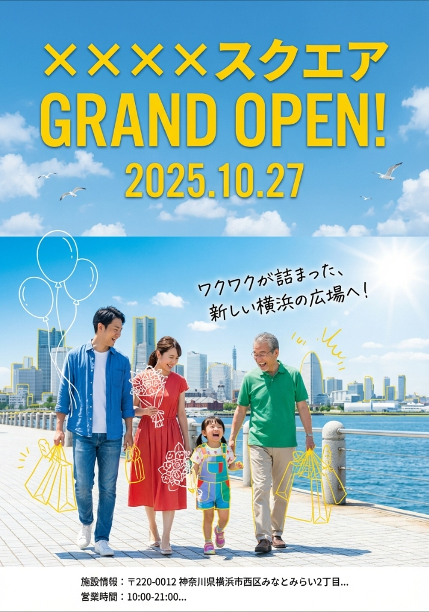
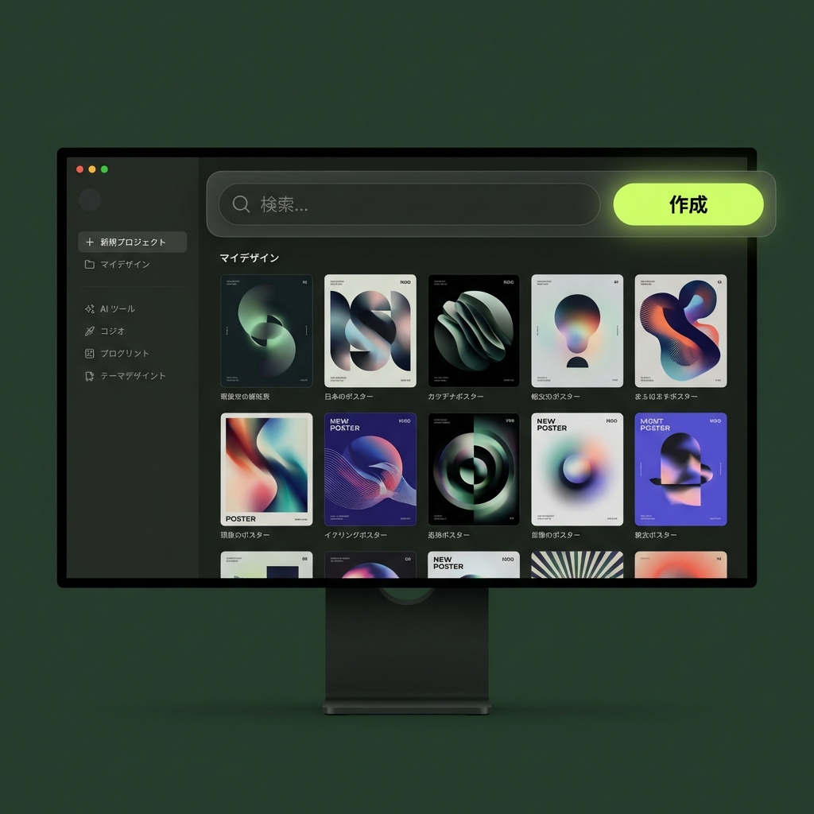
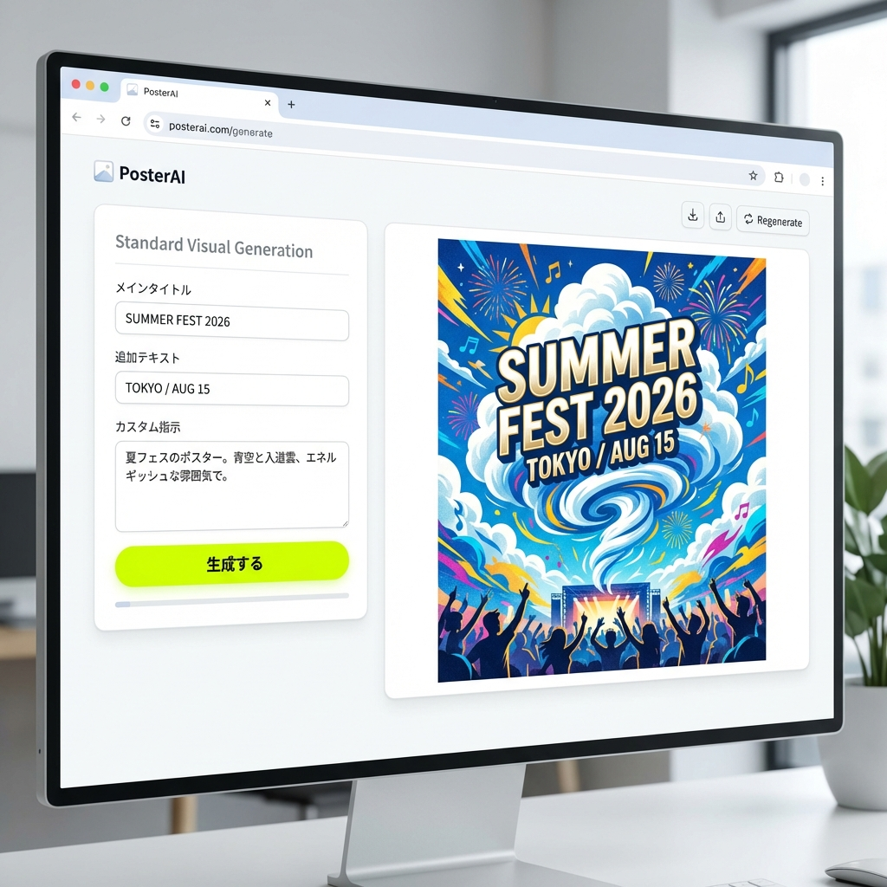
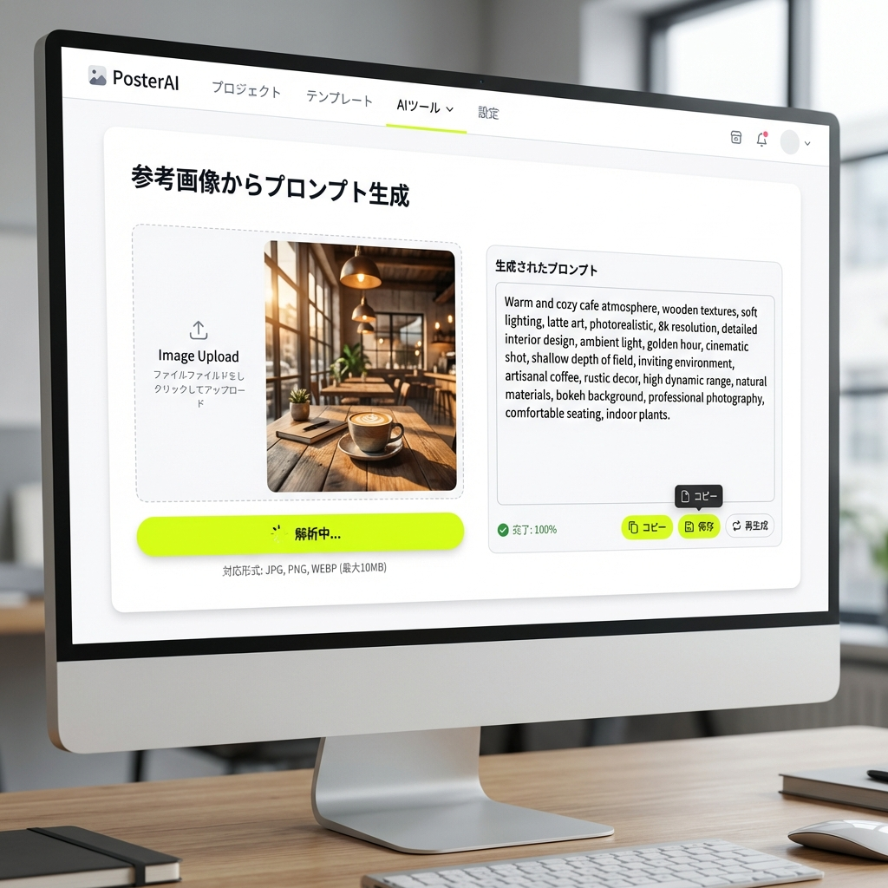
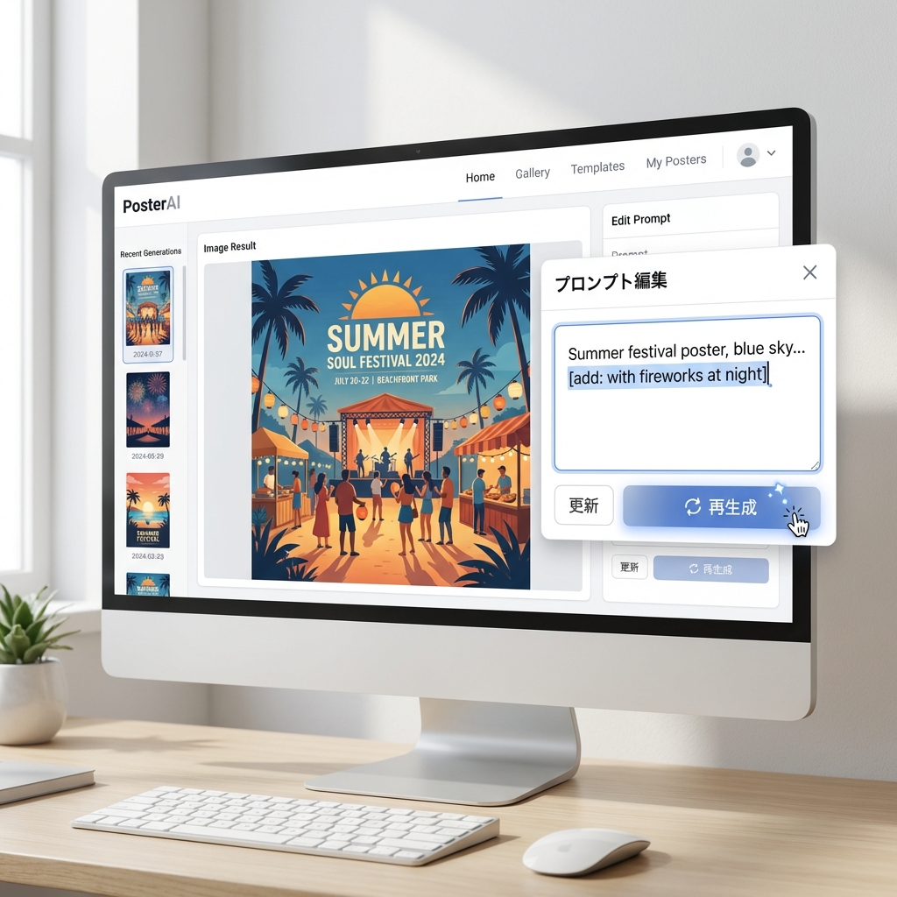

# PosterAI - AI搭載ポスター生成ツール

Nano Banana Pro (Powered by Google Gemini) を活用した、プロ品質のポスター生成Webアプリケーション。

**本番URL**: [https://poster-ai-app.onrender.com](https://poster-ai-app.onrender.com)


---

## 作成サンプル

<table>
  <tr>
    <td align="center">
      <br />
      <b>クリスマス抽選会</b>
    </td>
    <td align="center">
      <br />
      <b>グランドオープン</b>
    </td>
  </tr>
</table>

---

## スクリーンショット

### TOPページ / ダッシュボード


### 使い方ガイド

<table>
  <tr>
    <td align="center">
      <br />
      <b>テキストから生成</b>
    </td>
    <td align="center">
      <br />
      <b>画像参照 & 素材挿入</b>
    </td>
  </tr>
</table>

### AI編集スイート

<table>
  <tr>
    <td align="center">
      <br />
      <b>プロンプト再編集</b>
    </td>
    <td align="center">
      <br />
      <b>矩形（領域）編集</b>
    </td>
    <td align="center">
      <br />
      <b>テキスト編集</b>
    </td>
  </tr>
</table>

### プロジェクト保存 & 出力


---

## 概要

PosterAIは、テキスト入力やサンプル画像から、AIが自動的に高品質なポスターデザインを生成するツールです。**Nano Banana Pro** の最先端AI技術により、数秒でプロフェッショナルなビジュアルを作成できます。

v1.5.0では、**「Calmテーマによる洗練されたUI」**、**「Noto Sans JPによる美しい日本語表示」**、そして**「ダークモードに統一された使い方ガイド」**を実装し、より使いやすく美しいツールへと進化しました。

### 主な機能

- **AI画像生成**: Nano Banana Proによる高品質な画像生成
- **高精度画像解析**: アップロードした画像からデザイン要素（配色、構図、スタイル）を詳細抽出
- **2つの生成モード**:
  - **画像 + テキスト**: サンプル画像を参照して高再現性で生成
  - **テキストのみ**: 解析情報から新しいオリジナルデザインを生成
- **AIモデル選択機能 (v1.4.0)**:
  - **本番モデル (`gemini-3-pro-image-preview`)**: 高品質・サイズ遵守
  - **開発モデル (`gemini-2.5-flash-image`)**: 高速・低コスト
- **高画質ダウンロード**: Canvas APIによるクライアントサイド・アップスケールで印刷対応レベルの高解像度保存
- **AI編集スイート**:
  - **テキスト編集**: 生成された文字を直接打ち替え・フォント変更
  - **矩形（領域）編集**: Inpainting技術で指定範囲だけを修正・削除
  - **画像挿入**: ロゴや素材を後からレイアウトに追加
- **高度なセキュリティ対策**: CSP、監査ログ、レート制限の実装
- **ビジュアルガイド**: 実際の操作画面（UIモックアップ）を用いた分かりやすい使い方解説

---

## プロジェクト構造

最新のNext.js App RouterとFeature-basedディレクトリ構成を採用しています。

```
posterai-app/
├── app/                      # Next.js App Router
│   ├── page.tsx             # TOPページ
│   ├── generate/            # ポスター生成ページ (メイン機能)
│   ├── how-to-use/          # 使い方ページ (UIモックアップ搭載)
│   ├── admin/               # 管理者ダッシュボード
│   └── api/                 # API Routes (Serverless)
├── components/              # 共通UIコンポーネント (Shadcn/ui)
├── features/                # 機能別モジュール
│   └── poster-generator/    # ポスター生成機能のコアロジック
├── lib/                     # ユーティリティ & クライアント
│   ├── gemini.ts           # Gemini API Client
│   ├── supabase.ts         # Supabase Client
│   └── job-store.ts        # ジョブ状態管理
├── public/                  # 静的アセット
│   └── samples/             # UIモックアップ画像
└── docs/                    # 開発ドキュメント
```

---

## 技術スタック

### フロントエンド
- **Next.js 14** (App Router): フルスタックフレームワーク
- **React 18**: UIライブラリ
- **TypeScript**: 静的型付け
- **Tailwind CSS**: ユーティリティファーストCSS
- **Shadcn/ui**: アクセシビリティ対応コンポーネント
- **Lucide React**: アイコンセット

### バックエンド & AI
- **Nano Banana Pro**: 画像生成・解析・Inpainting (Powered by Google Gemini 3)
  - `gemini-3-pro-image-preview`
- **NextAuth.js**: 認証基盤 (Google OAuth)
- **Supabase**: データベース (ユーザー管理、設定保存)
- **Vercel / Render**: デプロイ環境

---

## 使い方

1. **ログイン**: Googleアカウントでワンクリックログイン
2. **ダッシュボード**: 「新規作成」からスタート
3. **生成設定**:
   - **テキスト生成**: 「夏のフェス」「高級なカフェ」など作りたいイメージを入力
   - **画像参照**: 参考画像をアップロードし、「このスタイルで」と指示
4. **編集**: 生成された画像をAIエディタで微調整（文字変更、部分修正）
5. **保存**: プロジェクトとして保存 (`.json`) または 画像としてダウンロード (`.png`)

詳細は [使い方ページ](/how-to-use) をご覧ください。（TOPページと同様の没入感あるダークテーマで解説しています）

---

## 料金体系概要 (v1.5.0)

**現在: Gemini 3 Pro Image Preview (無料枠/プレビュー版を使用)**

- **画像生成**: 高品質かつコスト効率の良い運用が可能
- **DPI最適化**: 175 DPI設定により、A4サイズでも十分な品質を確保しつつ生成コストを削減
- **無料枠**: 1日あたりの生成制限内で利用可能 (レートリミット実装済み)

詳細は [docs/MODELS_AND_PRICING.md](docs/MODELS_AND_PRICING.md) を参照。

---

## 開発者・管理者向け

### セットアップ

```bash
# 1. 依存関係のインストール
npm install

# 2. 環境変数 (.env.local) の設定
GEMINI_API_KEY=...
NEXT_PUBLIC_SUPABASE_URL=...
...

# 3. 開発サーバー起動
npm run dev
```

### デプロイ

Render Web Servicesへのデプロイを推奨します。`main` ブランチへのプッシュで自動デプロイがトリガーされます。
