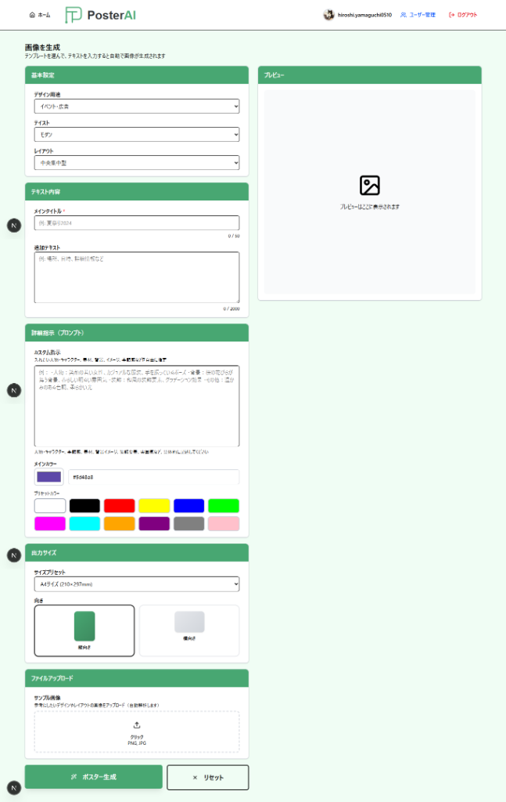

# PosterAI - AI搭載ポスター生成ツール

Google Gemini AIを活用した、プロ品質のポスター生成Webアプリケーション。

🔗 **本番URL**: [https://poster-ai-app.onrender.com](https://poster-ai-app.onrender.com)


---

## 📸 スクリーンショット

### TOPページ


### ポスター生成画面


### 生成サンプル
| グランドオープン告知 | クリスマスキャンペーン |
|:---:|:---:|
|  |  |

---

## 🌟 概要

PosterAIは、テキスト入力やサンプル画像から、AIが自動的に高品質なポスターデザインを生成するツールです。Google Gemini 3 Proの最先端AI技術により、数秒でプロフェッショナルなビジュアルを作成できます。

### 主な機能

- 🎨 **AI画像生成**: Google Gemini 3 Proによる高品質な画像生成
- 🖼️ **高精度画像解析**: アップロードした画像からデザイン要素を詳細抽出
  - 配色システム（HEX値、面積比率、明度・彩度）
  - タイポグラフィ詳細（ウェイト、サイズ%、行間、字間）
  - **アートスタイル・画風分析**（線画、塗り、テクスチャ、ブラシ）
  - ビジュアル要素（被写体、背景、構図、光と影）
- 🎯 **2つの生成モード**:
  - **画像 + テキスト**: サンプル画像を参照して高再現性で生成
  - **テキストのみ**: 解析情報から新しいオリジナルデザインを生成
- 🎛️ **画像参照強度コントロール**: 3段階で調整可能（強い/普通/弱い）
- 🎭 **カスタマイズ可能**: カラーパレット、レイアウト、テイストなど細かく調整可能
- ✏️ **画像編集機能**: 生成後にプロンプトで部分編集（背景変更、色調整等）
- 📎 **画像挿入機能**: ロゴや画像を最大5枚まで挿入・差し替え可能
- 🔐 **安全な認証**: Google認証による簡単ログイン
- 👥 **ユーザー管理**: 管理者による許可制アクセス管理

---

## 🚀 クイックスタート

### 必要な環境

- Node.js 18.x 以上
- npm または yarn
- Google Cloud アカウント（Gemini API使用）
- Supabase アカウント（データベース）

### インストール

1. **リポジトリのクローン**
   ```bash
   git clone <repository-url>
   cd posterai-app
   ```

2. **依存関係のインストール**
   ```bash
   npm install
   ```

3. **環境変数の設定**
   
   `.env.local` ファイルを作成し、以下の変数を設定：
   
   ```env
   # Google Gemini API
   GEMINI_API_KEY=your_gemini_api_key_here
   
   # NextAuth.js
   NEXTAUTH_URL=http://localhost:3000
   NEXTAUTH_SECRET=your_nextauth_secret_here
   
   # Google OAuth
   GOOGLE_CLIENT_ID=your_google_client_id
   GOOGLE_CLIENT_SECRET=your_google_client_secret
   
   # Supabase
   NEXT_PUBLIC_SUPABASE_URL=your_supabase_url
   NEXT_PUBLIC_SUPABASE_ANON_KEY=your_supabase_anon_key
   SUPABASE_SERVICE_ROLE_KEY=your_supabase_service_role_key
   ```

4. **開発サーバーの起動**
   ```bash
   npm run dev
   ```
   
   ブラウザで [http://localhost:3000](http://localhost:3000) を開く

---

## 📁 プロジェクト構造

```
posterai-app/
├── app/                      # Next.js App Router
│   ├── page.tsx             # TOPページ
│   ├── generate/            # ポスター生成ページ
│   ├── how-to-use/          # 使い方ページ
│   ├── admin/               # 管理者ページ
│   │   └── users/           # ユーザー管理
│   └── api/                 # APIルート
│       ├── auth/            # NextAuth.js認証
│       ├── analyze-image/   # 画像解析API
│       ├── generate-poster/ # ポスター生成API
│       ├── jobs/            # ジョブ管理API
│       └── admin/           # 管理者API
├── components/              # 共通コンポーネント
│   └── ui/                  # UIコンポーネント
├── features/                # 機能別コンポーネント
│   └── poster-generator/    # ポスター生成機能
├── lib/                     # ユーティリティ
│   ├── gemini.ts           # Gemini API クライアント
│   ├── supabase.ts         # Supabase クライアント
│   ├── job-store.ts        # ジョブストア
│   └── notifications.ts    # 通知機能
├── types/                   # TypeScript型定義
├── public/                  # 静的ファイル
├── docs/                    # ドキュメント
│   ├── DESIGN_SYSTEM.md    # デザインシステム
│   └── MODELS_AND_PRICING.md # モデルと料金
└── CHANGELOG.md            # 変更履歴
```

---

## 🎨 デザインシステム

PosterAIは統一されたダークテーマデザインシステムを採用しています。

### カラーパレット

- **メイン背景**: `#1a3d2e` (ダークグリーン)
- **カード背景**: `bg-gray-800` / `bg-gray-900`
- **テキスト**: `text-white`, `text-gray-300`, `text-gray-400`
- **アクセント**: `text-green-400`, `text-blue-400`

詳細は [docs/DESIGN_SYSTEM.md](./docs/DESIGN_SYSTEM.md) を参照してください。

---

## 📖 使い方

### 1. ログイン

1. TOPページの「Googleで始める」ボタンをクリック
2. Googleアカウントでログイン
3. 管理者による承認が必要（初回のみ）

### 2. ポスター生成

#### 基本設定
- デザイン用途を選択（イベント、SNS投稿など）
- テイストを選択（モダン、ポップなど）

#### 詳細設定
- タイトルを入力
- サブタイトル、本文を追加（任意）
- カラーパレットを選択

#### サンプル画像（任意）
- 参考デザインをアップロード
- AIが自動解析してデザイン設定を抽出
- **解析精度**: 1500-2500文字の超詳細分析

#### 生成モード選択
サンプル画像をアップロードした場合、以下から選択：

**画像 + テキスト（デフォルト）**:
- サンプル画像を参照して高再現性で生成
- 画像参照強度を調整可能：
  - 🔥 **強い (80:20)**: 画像を最優先で忠実に再現
  - ⚖️ **普通 (75:25)**: バランス型【推奨】
  - 📝 **弱い (70:30)**: 詳細情報も重視

**テキストのみ**:
- 解析された詳細情報から新規デザイン生成
- よりオリジナリティのある結果

#### 生成実行
- 「ポスター生成」ボタンをクリック
   - 30秒〜1分で生成完了

### 3. 画像の保存

生成された画像を右クリックで保存、または印刷用にダウンロード

詳しくは [使い方ページ](http://localhost:3000/how-to-use) を参照してください。

---

## 👨‍💼 管理者機能

### ユーザー管理

管理者は `/admin/users` ページから以下の操作が可能：

- ✅ 新規ユーザーの追加
- ✅ ユーザーの有効化/無効化
- ✅ 管理者権限の付与/剥奪
- ✅ ユーザーの削除

### 管理者権限の確認

Supabaseの `allowed_users` テーブルで `is_admin` フラグを確認。

---

## 🔧 技術スタック

### フロントエンド
- **Next.js 14** (App Router)
- **React 18**
- **TypeScript**
- **Tailwind CSS**
- **Shadcn/ui**

### バックエンド
- **Next.js API Routes**
- **NextAuth.js** (認証)
- **Google Gemini API** (AI画像生成)
- **Supabase** (データベース)

### その他
- **Lucide React** (アイコン)
- **Playwright** (E2Eテスト)

---

## 🤖 AIモデル


PosterAIは最新のGoogle AIモデルを使用しています：

## 💰 料金体系

### 使用モデル

- **画像解析**: gemini-3-pro-image-preview
- **ポスター生成**: gemini-3-pro-image-preview

### コスト（月間利用想定）

| 項目 | 単価 | 月100枚 | 月300枚 |
|------|------|---------|---------|
| 画像解析 | ¥0.17/回 | ¥17 | ¥51 |
| ポスター生成（A4） | ¥20/枚 | ¥2,000 | ¥6,000 |
| ポスター生成（B4） | ¥36/枚 | ¥3,600 | ¥10,800 |
| **合計（A4のみ）** | - | **¥2,017** | **¥6,051** |

**詳細**: [MODELS_AND_PRICING.md](docs/MODELS_AND_PRICING.md)

---

## 🚀 将来の最適化案

### Imagen 4.0（検証結果）

**テスト結果**: ❌ 本番運用不可
- Dynamic Shared Quota問題
- 予測不可能な429エラー
- 成功率50%（テスト時）

**結論**: 現時点では予測可能性と安定性を優先し、Preview版を継続使用
- **合計: 約180円 ($1.20/月)** ⭐ 大幅にコスト削減！

詳細は [MODELS_AND_PRICING.md](docs/MODELS_AND_PRICING.md) をご覧ください。

---

## 📝 開発ガイド

### コーディング規約

1. **TypeScript**: すべてのファイルで型定義を使用
2. **コンポーネント**: 関数コンポーネント + Hooks
3. **スタイリング**: Tailwind CSS クラスを使用
4. **命名規則**:
   - コンポーネント: PascalCase (`PosterForm.tsx`)
   - ファイル: kebab-case (`job-store.ts`)
   - 関数: camelCase (`handleGenerate`)

### デザイン原則

- ✅ **完全不透明**: 透明エフェクト（`/opacity`）は使用しない
- ✅ **高コントラスト**: 視認性を最優先
- ✅ **一貫性**: デザインシステムに従う
- ❌ **ブラーエフェクト禁止**: `backdrop-blur` は使用しない

詳細は [docs/DESIGN_SYSTEM.md](./docs/DESIGN_SYSTEM.md) を参照。

---

## 🧪 テスト

```bash
# ユニットテスト（準備中）
npm run test

# E2Eテスト（Playwright）
npm run test:e2e
```

---

## 📦 ビルド & デプロイ

### プロダクションビルド

```bash
npm run build
npm run start
```

### Vercelへのデプロイ

1. Vercelアカウントにリポジトリを接続
2. 環境変数を設定
3. 自動デプロイ

---

## 🔍 トラブルシューティング

### 画像生成エラー

1. **GEMINI_API_KEY** が正しく設定されているか確認
2. Google Cloud コンソールでAPIが有効化されているか確認
3. コンソールログでエラー詳細を確認

### 認証エラー

1. **GOOGLE_CLIENT_ID** と **GOOGLE_CLIENT_SECRET** が正しいか確認
2. Google Cloud コンソールでリダイレクトURLが設定されているか確認
   - 開発: `http://localhost:3000/api/auth/callback/google`
   - 本番: `https://your-domain.com/api/auth/callback/google`

### データベースエラー

1. Supabaseの接続情報が正しいか確認
2. `allowed_users` テーブルが存在するか確認
3. Row Level Security (RLS) が正しく設定されているか確認

---

## 📄 ライセンス

このプロジェクトはMITライセンスの下で公開されています。

---

## 🤝 コントリビューション

プルリクエストは大歓迎です。大きな変更の場合は、まずissueを開いて変更内容を議論してください。

1. このリポジトリをフォーク
2. フィーチャーブランチを作成 (`git checkout -b feature/amazing-feature`)
3. 変更をコミット (`git commit -m 'Add amazing feature'`)
4. ブランチにプッシュ (`git push origin feature/amazing-feature`)
5. プルリクエストを作成

---

## 📞 サポート

問題や質問がある場合は、GitHubのissuesページで報告してください。

---

## 🙏 謝辞

- [Google Gemini](https://deepmind.google/technologies/gemini/) - AI画像生成
- [Next.js](https://nextjs.org/) - Reactフレームワーク
- [Supabase](https://supabase.com/) - バックエンドサービス
- [Shadcn/ui](https://ui.shadcn.com/) - UIコンポーネント

---

**Built with ❤️ using Google Gemini AI**
