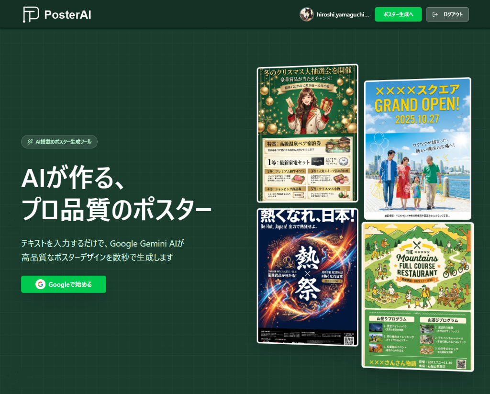
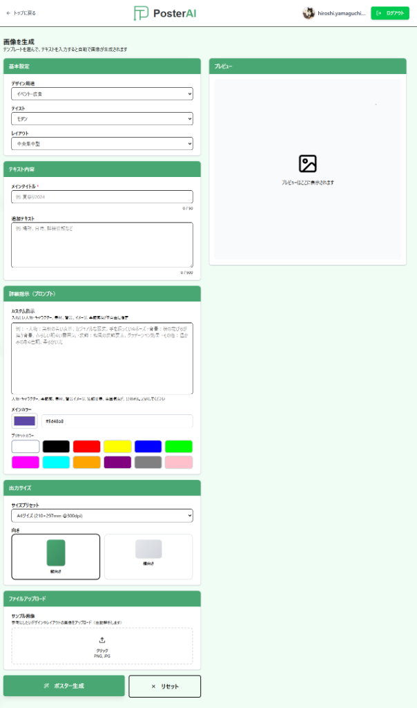

# PosterAI App

<div align="center">
  <h3>🎨 AIを活用したポスター自動生成アプリケーション</h3>
  <p>Google Gemini APIを使用して、テキストプロンプトから高品質なポスターデザインを生成します</p>
</div>

---

## 📸 スクリーンショット

### ホームページ
<div align="center">
  
</div>

### ポスター生成ページ
<div align="center">
  
  <p><em>わずか数秒でプロフェッショナルなポスターデザインを生成</em></p>
</div>

---

## ✨ 生成例

<div align="center">
  
  
  
  <p><em>わずか数秒でプロフェッショナルなポスターデザインを生成</em></p>
</div>

---

## 🎯 主な機能

- 📝 **テキストプロンプトからポスター生成** - タイトル、説明文から自動でデザイン生成
- 🎨 **カスタマイズ可能なデザイン設定**
  - デザイン用途（イベント告知、広告、SNS投稿など）
  - テイスト選択（モダン、ミニマル、ポップ、エレガントなど）
  - レイアウト選択（中央揃え、分割レイアウトなど）
  - カラーパレット（原色12色のプリセット + カスタムカラー）
- 🖼️ **画像解析機能** - サンプル画像をアップロードして自動でデザイン設定を抽出
- 📐 **柔軟な出力サイズ** - A3, A4, B4, B5, カスタムサイズ（px/mm切り替え対応）
- 💬 **詳細指示プロンプト** - 人物、背景、季節感などを詳細に指定可能
- 🔄 **リセット機能** - ワンクリックでフォームと生成画像をクリア
- 🔐 **Google認証** - セキュアなログイン機能

## 🛠️ 技術スタック

- **フレームワーク**: Next.js 15 (App Router)
- **言語**: TypeScript
- **スタイリング**: Tailwind CSS v4
- **UI コンポーネント**: Radix UI, Lucide React
- **認証**: NextAuth.js v4
- **AI API**: Google Gemini API
  - `imagen-4.0-generate-001` - 画像生成（Imagen 4.0 Standard）
  - `gemini-2.0-flash-exp` - 画像解析

---

## 🚀 セットアップ

### 1. リポジトリをクローン

```bash
git clone https://github.com/HIROSHI2285/posterAI_app.git
cd posterAI_app/posterai-app
```

### 2. 依存関係をインストール

```bash
npm install
```

### 3. 環境変数を設定

`.env.example`をコピーして`.env`ファイルを作成：

```bash
cp .env.example .env
```

`.env`ファイルを編集してAPIキーを設定：

```env
GEMINI_API_KEY=your_gemini_api_key_here
```

**APIキーの取得方法:**
1. [Google AI Studio](https://aistudio.google.com/app/apikey) にアクセス
2. 「Create API Key」をクリック
3. 生成されたAPIキーをコピーして`.env`に貼り付け

### 4. 開発サーバーを起動

```bash
npm run dev
```

ブラウザで [http://localhost:3000](http://localhost:3000) を開きます。

## 使い方

1. **デザイン設定**
   - 用途、テイスト、レイアウトを選択
   - メインカラーを選択（カラーパレットまたはカラーピッカー）

2. **テキスト入力**
   - メインタイトル（必須）
   - 追加テキスト（任意）

3. **詳細指示（オプション）**
   - 人物・キャラクターの詳細
   - 背景、イメージ、季節感
   - 装飾要素など

4. **サンプル画像（オプション）**
   - 参考デザインをアップロードすると自動解析
   - フォーム設定が自動入力されます

5. **生成**
   - 「ポスター生成」ボタンをクリック
   - 数秒でAIが画像を生成

## プロジェクト構造

```
posterai-app/
├── app/
│   ├── api/
│   │   ├── analyze-image/      # 画像解析API
│   │   └── generate-poster/    # ポスター生成API
│   ├── generate/                # メインページ
│   └── page.tsx                 # ランディングページ
├── components/
│   └── ui/                      # UIコンポーネント
├── features/
│   └── poster-generator/
│       └── components/          # ポスター生成フォーム
├── types/
│   └── poster.ts                # 型定義
└── public/                      # 静的ファイル
```

## ビルド

本番用ビルドを作成：

```bash
npm run build
npm start
```

## 🔐 環境変数

| 変数名 | 説明 | 必須 |
|--------|------|------|
| `GEMINI_API_KEY` | Google AI Studio APIキー | ✅ |
| `NEXTAUTH_URL` | NextAuthのベースURL（例: `http://localhost:3000`） | ✅ |
| `NEXTAUTH_SECRET` | NextAuthのシークレットキー | ✅ |
| `GOOGLE_CLIENT_ID` | Google OAuth クライアントID | ✅ |
| `GOOGLE_CLIENT_SECRET` | Google OAuth クライアントシークレット | ✅ |
| `ALLOWED_EMAILS` | ログイン許可するメールアドレス（カンマ区切り） | ✅ |

---

## 🔒 セキュリティ

- `.env`ファイルは`.gitignore`に含まれており、Gitリポジトリにコミットされません
- APIキーなどの機密情報は公開されません
- `.env.example`には実際の値は含まれていません

## ライセンス

MIT

## 作者

HIROSHI2285

## リンク

- [GitHub Repository](https://github.com/HIROSHI2285/posterAI_app)
- [Google AI Studio](https://aistudio.google.com/)
